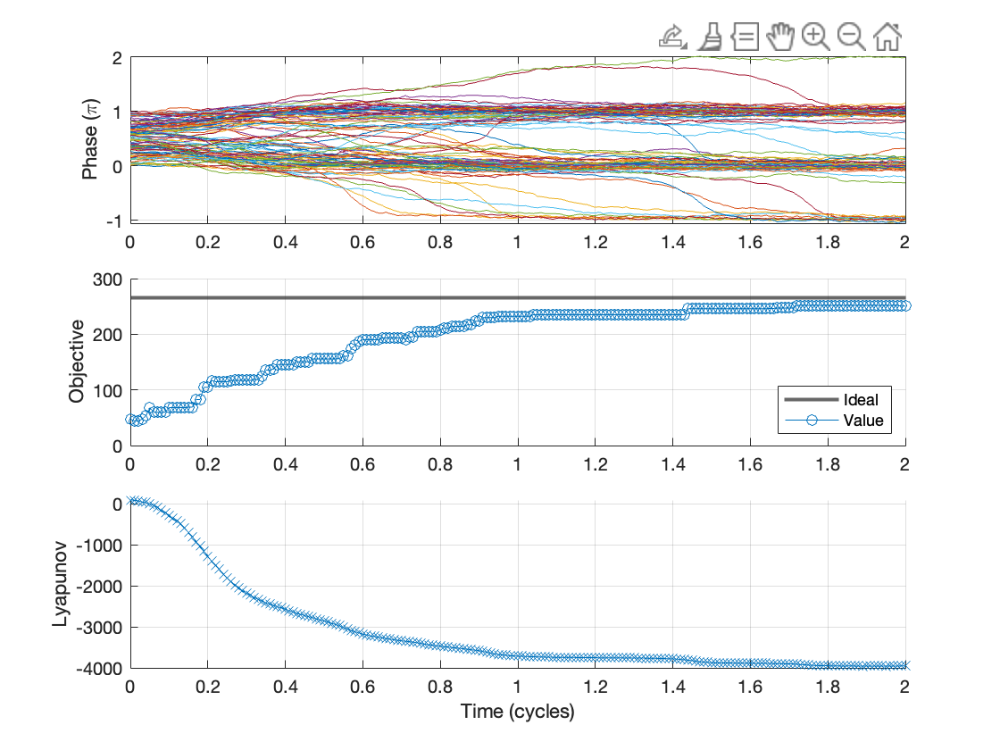

# kuramoto

How can Kuramoto oscillators be used for combinatorial optimization and learning?

This is personal research to connect a hodge-podge of existing work. A [custom PCB](https://gigabug.org/posts/bug8/) was developed as an experimental testbed.
- https://scala.uc3m.es/publications_MANS/PDF/finalKura.pdf
- https://arxiv.org/pdf/2007.05882

- https://arxiv.org/pdf/2504.18399
- https://arxiv.org/pdf/2503.10442

- https://journals.aps.org/pre/abstract/10.1103/PhysRevE.111.044310

- https://arxiv.org/pdf/2509.13560

