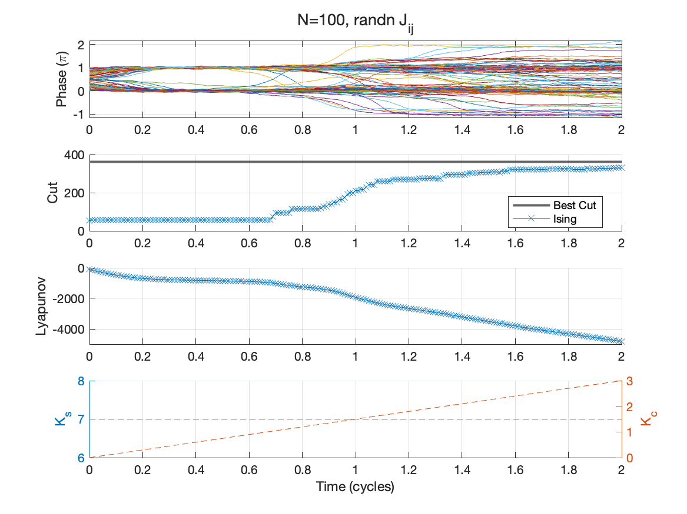

# Kuramoto Model for Combinatorial Optimization

This repository explores how networks of coupled oscillators can be analog solvers of NP-Hard combinatorial optimization problems. The [Kuramoto model](https://en.wikipedia.org/wiki/Kuramoto_model) describes the synchronization of coupled oscillators, and can be used to minimize Ising Hamiltonians, enabling physical systems to solve problems like MaxCut.

## Hardware

I lead the development of a custom circuit board ([arXiv:2512.23720](https://arxiv.org/abs/2512.23720)) as an experimental testbed for this oscillator-based computing framework.

## Simulation

The basic Kuramoto model can be extended to a stochastic differential equation with an added term to enforce binary phase configurations (Wang & Roychowdhury).

**Figure**: Solving a 100-node MaxCut instance with random Gaussian weights.
- **Top**: Oscillator phases evolving over time, eventually clustering near integer multiples of π that represent 0 or 1
- **Second**: Cut value compared to the optimal solution (gray line) found by a classical Tabu solver
- **Third**: Lyapunov energy decreasing as the system finds better configurations
- **Bottom**: Time-varying control annealing parameters 

## References

- Wang & Roychowdhury, [OIM: Oscillator-based Ising Machines](https://arxiv.org/abs/1903.07163)
- Chou et al., [Analog Coupled Oscillator Based Weighted Ising Machine](https://arxiv.org/abs/1906.09079)
- Hoppensteadt & Izhikevich, [Oscillatory Neurocomputers with Dynamic Connectivity](https://journals.aps.org/prl/abstract/10.1103/PhysRevLett.82.2983)

